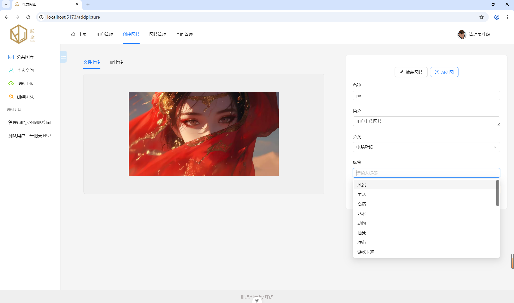
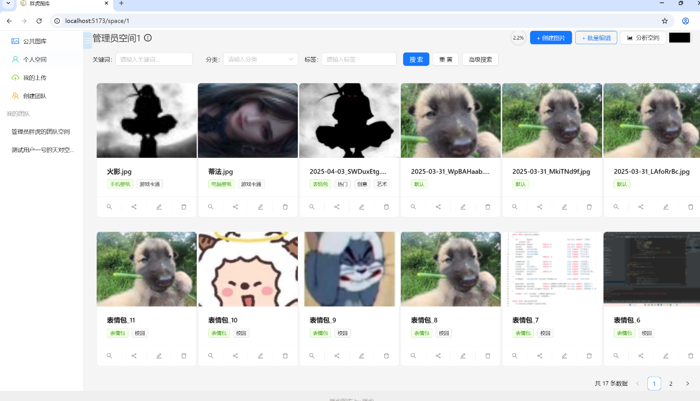
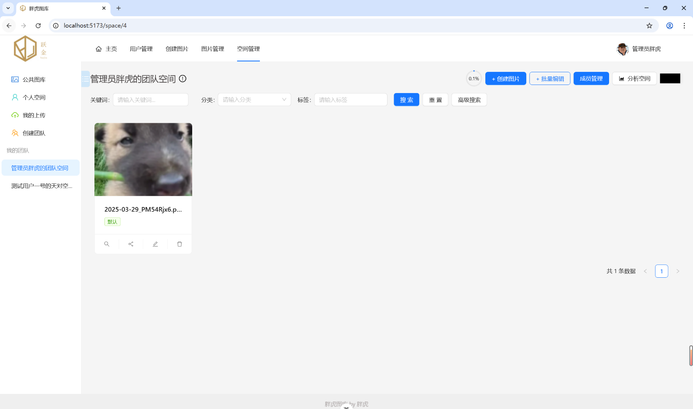
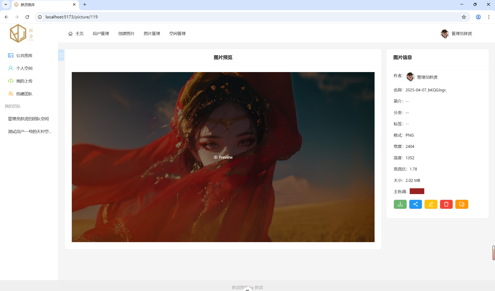
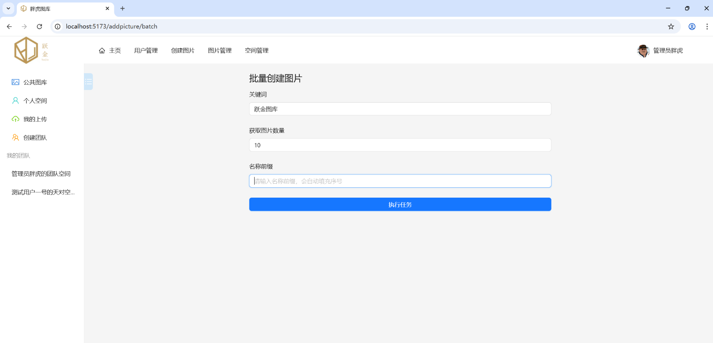
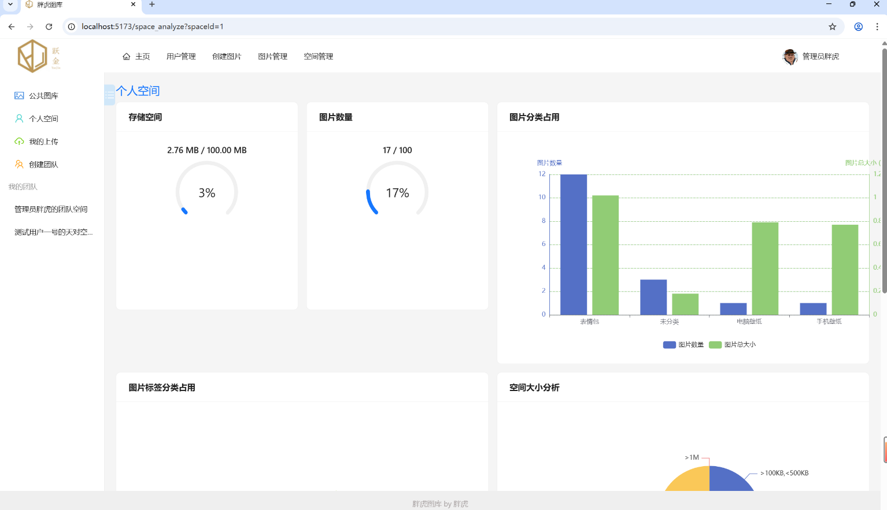
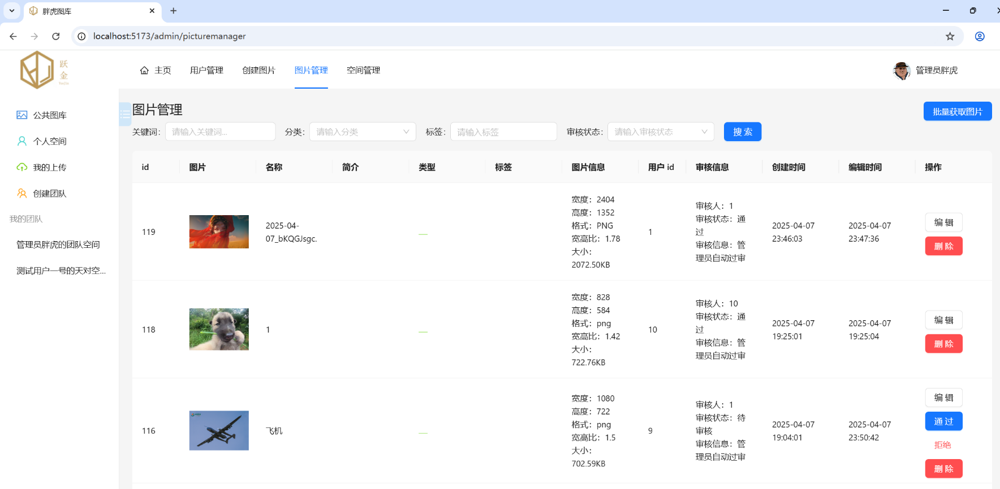
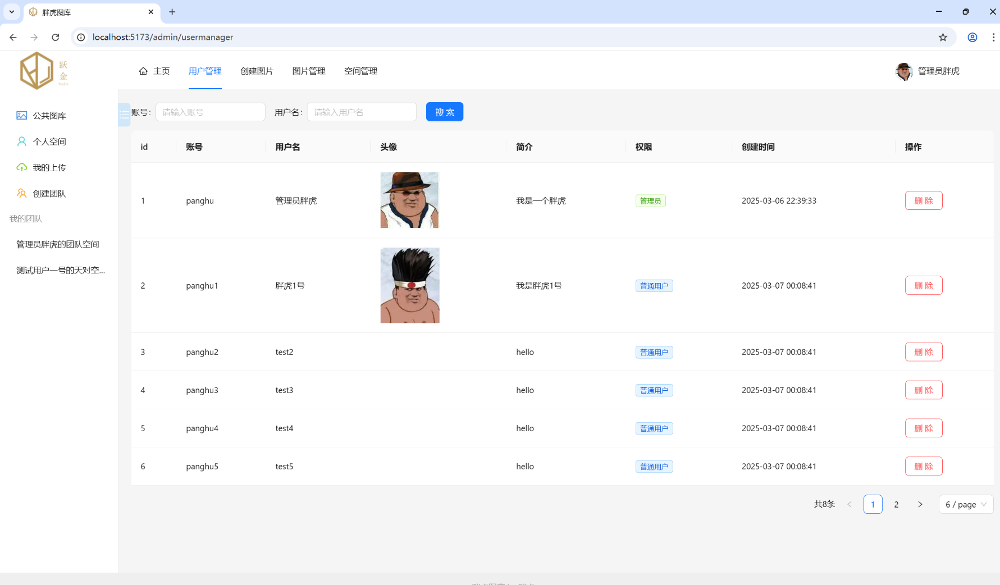
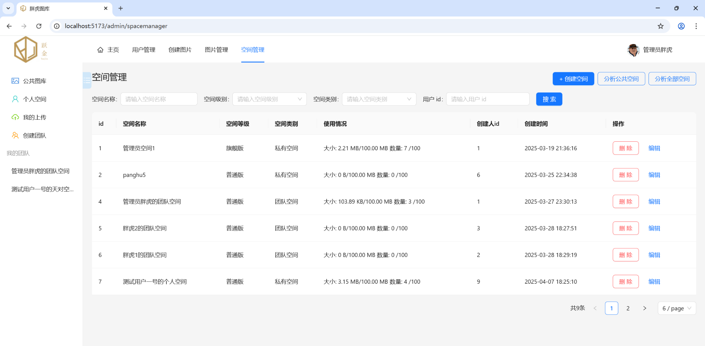

# 跃金图库前端代码

## 技术栈

1. 框架：Vue3
2. 语言： TypeScript
3. 仓库管理：Pinia
4. UI框架： Ant Design of Vue
5. 路由：Vue Router
6. 请求工具：Axios

## 图片模块

- 公共图库和私人空间
- 多级分类
- 审核机制
- 腾讯云COS的对象存储
- AI扩图
- 批量获取图片
- 以图搜图
- 多级缓存图片

## 社交模块

- 用户的登入和注册
- 用户的点赞，分享，评论，阅读

## 空间模块

- 团队空间WebSocket协作编辑
- 用户的基于So-Token权限检验
- 空间分析
- 团队空间成员管理

## 前端环境

- Node.js 16+
- npm 8+

## 前端启动

1. 安装依赖：`npm install`
2. 开发环境：`npm run dev`
3. 生产构建：`npm run build`

# 图片展示

